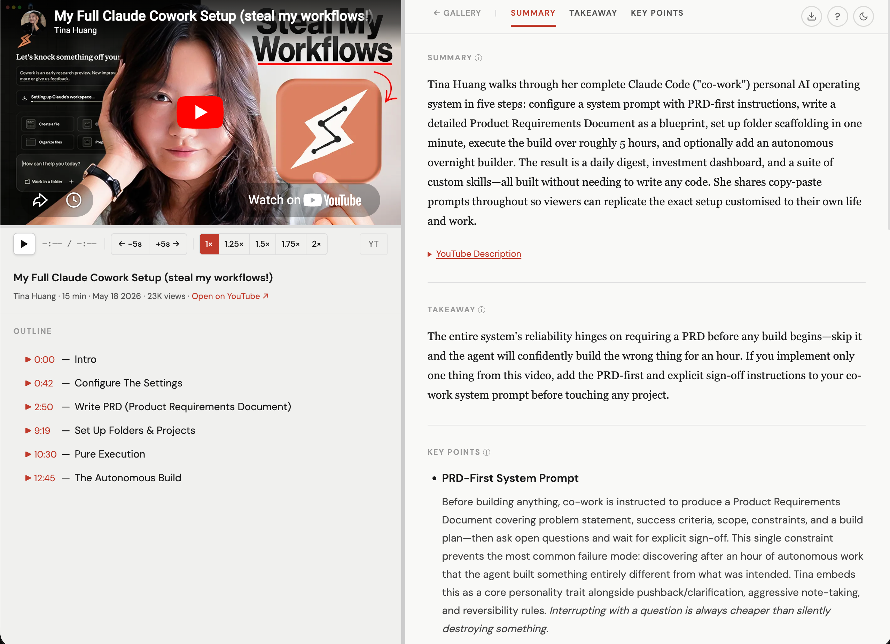
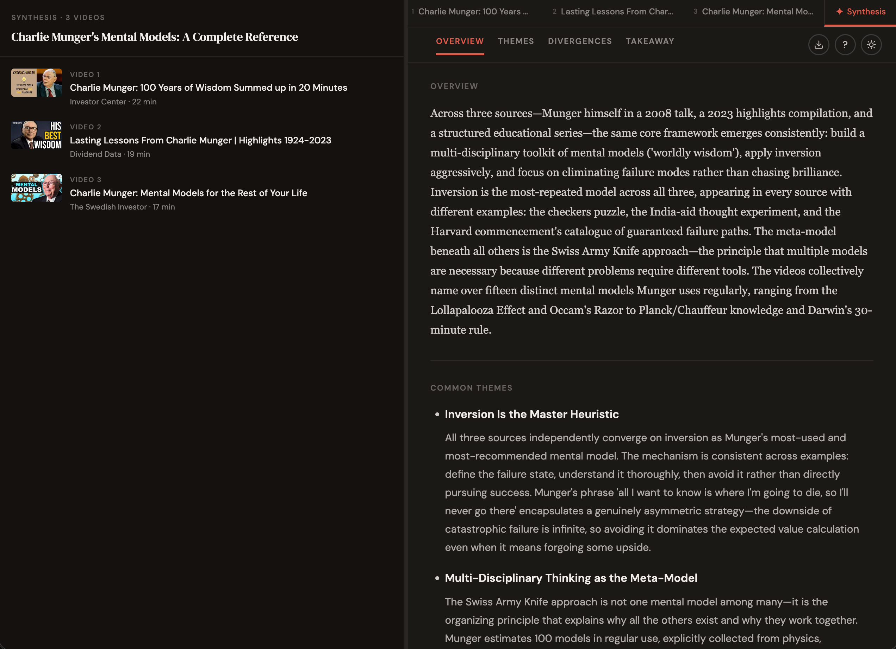
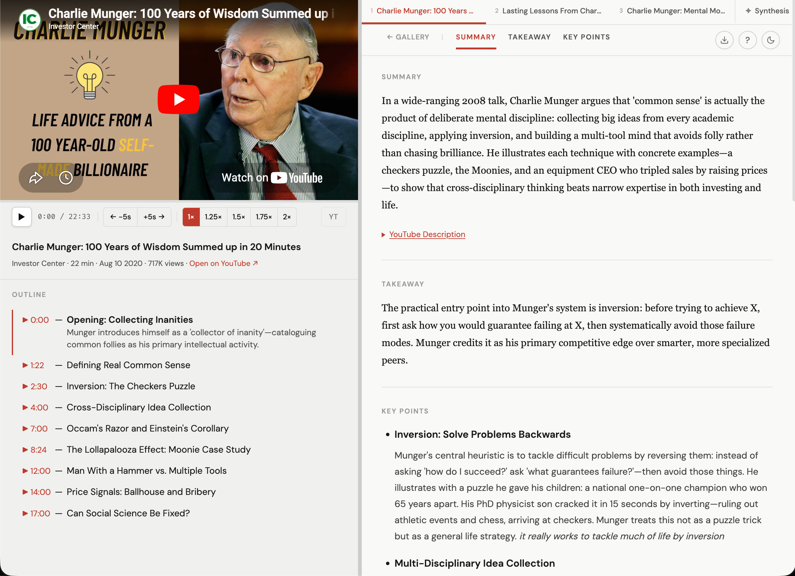
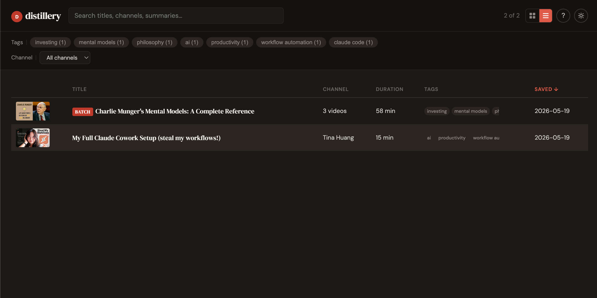

# Distillery

**Turn any YouTube video into a polished research report.**

Distillery is a coding agent skill that fetches a YouTube transcript and generates a structured HTML report — executive summary, takeaway, key points with analysis, timestamped topic outline, and an embedded in-page player.









---

## What you get

- **Executive summary** — 3–5 sentence TL;DR overview
- **Takeaway** — the single most important insight (1–3 sentences)
- **Key points** — bulleted, scannable insights with supporting detail
- **Timestamped outline** — click topics to expand summaries; click timestamps to jump the player
- **In-page YouTube player** — watch while reading; auto-highlights the current section
- **Markdown export** — copy the full report as Markdown in one click
- **Dark mode** — auto-detects system preference; remembered across sessions
- **Video gallery** — browse, search, and filter all your saved reports by title, channel, tag, or keyword

---

## Requirements

| Tool | Purpose |
|---|---|
| A supported coding agent | Runs the skill (see [Supported Agents](#supported-agents)) |
| Python 3.10+ | Fetches the transcript and metadata |

> **Note:** Distillery only works for videos that have captions/subtitles available. Videos with captions disabled will produce an error. YouTube Shorts are not supported.

---

## Supported Agents

Distillery uses the universal [SKILL.md](https://agents.md/) format — any agent that supports it can run this skill.

---

## Install

Clone the repo and run the install script (no extra tools required — uses stdlib `venv` and `pip`):

```bash
git clone https://github.com/<your-github>/distillery.git
cd distillery
./install.sh claude   # or: gemini | opencode | cursor | agents
```

This copies the skill files and creates an isolated `.venv` in the skill directory — no global Python packages needed.

> **Other agents:** replace `claude` with `gemini`, `opencode`, `cursor`, or `agents` depending on which agent you use.

---

## Usage

### In Claude Code

```
/distillery https://www.youtube.com/watch?v=...
```

Claude fetches the transcript, generates the report, and opens it in your browser at `http://localhost:8765/`.

### Gallery

Browse, search, and filter all your saved reports by title, channel, tag, or keyword:

```
/distillery-gallery
```

---

## Dev server

To iterate on `skills/distillery/template.html` without running a real video:

```bash
task dev   # requires go-task
```

Opens a rendered sample report at `http://localhost:8765/sample_output.html`.

---

## Repo layout

```
distillery/
  skills/
    distillery/
      SKILL.md          ← skill prompt (source of truth)
      template.html     ← HTML report template (source of truth)
    distillery-gallery/
      SKILL.md          ← gallery skill prompt (source of truth)
      index.html        ← gallery viewer (source of truth)
      scripts/
        backfill_meta.py  ← backfills meta blocks into old reports
        build_index.py    ← builds manifest.json and copies index.html
  scripts/
    yt_template_dev.py  ← dev server helper
  install.sh            ← install script (no extra tools required)
  requirements.txt      ← runtime Python dependencies (pinned)
  requirements-dev.txt  ← dev/test dependencies
```

**Always edit files in this repo, then redeploy with `./install.sh <agent>`.** Never edit directly in `~/.{agent}/skills/`.

---

## Dependencies

Runtime dependencies are pinned to exact versions in `requirements.txt`:

| Package | Purpose |
|---|---|
| `youtube-transcript-api` | Fetches transcript tracks from YouTube |
| `yt-dlp` | Fetches enriched metadata: chapters, description, view count |

Dev dependencies (tests only) are in `requirements-dev.txt`.

---

## Credits

Forked from [video-lens](https://github.com/kar2phi/video-lens) by [kar2phi](https://github.com/kar2phi).

## Contributing

PRs welcome. Keep the skill prompt in `skills/distillery/SKILL.md` and the HTML template in `skills/distillery/template.html` — those are the sources of truth.

## License

MIT
